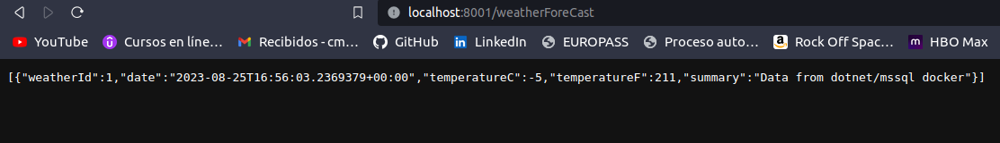

# EJEMPLO DE DOTNET USANDO REPOSITORY PATTERN Y DOCKER
Ejemplo de Repository Patter usando .Net

## Dependencias
- [Docker](https://www.docker.com/)
- [Docker Compose](https://docs.docker.com/get-started/08_using_compose/)


## Pasos

- Clonar este repositorio:
```sh
$ git clone https://github.com/cmcodexv/DotnetRepositoryPattern.git
``` 
- Ejecutar el archivo dockerfile:
```sh
$ docker-compose build
``` 
- Ejecutar Ejecutar archivo "docker-compose.yml":
```sh
$ docker-compose.yml up -d
``` 

- Si todo ha ido bien hasta este punto, deberíamos ver esto en docker desktop:


- Accedemos a la ruta de la api y el controlador, en este caso:
```sh
http://localhost:8001/weatherForeCast
```

- Lograremos ver la información obtenida desde mssql docker:



- Podemos verificar que todo ha salido bien en el log del servicio mssql en docker, loramos observar los mensajes de consolas que se definieron en el contexto:


- Usando adminer podemos ingresar al servicio mssql para verificar que existen los datos:


- Verificamos que los datos provienen de la tabla:


